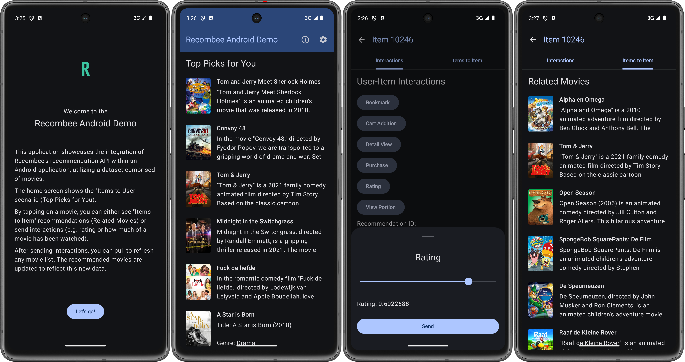

# Recombee Android Demo

This application showcases the integration of [Recombee's](https://www.recombee.com/) recommendation
API within an Android application, utilizing a dataset comprised of movies.
Specifically, it integrates the [Kotlin API client](https://github.com/Recombee/kotlin-api-client).

The home screen shows the "Items to User" scenario (Top Picks for You).

By tapping on a movie, you can either see "Items to Item" recommendations (Related Movies) or send
interactions (e.g. rating or how much of a movie has been watched).

After sending interactions, you can pull to refresh any movie list. The recommended movies are
updated to reflect this new data.

## Screenshots

## How to run

Download the APK file from the Releases section and install it on your Android device.

## How to build

1. Clone the repository
2. Open the project in Android Studio
3. Build the project
4. Run the app on your device

## Code structure

The code uses Jetpack Compose for the UI, including its navigation toolkit.
The rest of the code is fully in Kotlin.

The app was designed using [Material 3 guidelines](https://m3.material.io/), with support for
dynamic colors based on the user's current color theme and a fallback theme. Both light and dark
themes are supported.

For the entire application, a single `RecombeeClient` instance is created in the `di.RecombeeModule`
object and injected into the ViewModels using Dagger Hilt.

These ViewModels fetch data from Recombee by means of the provided client.
The received data is then displayed in Composables using Flow.

For the user ID, a random UUID is generated and stored using the AndroidX `DataStore` library.
